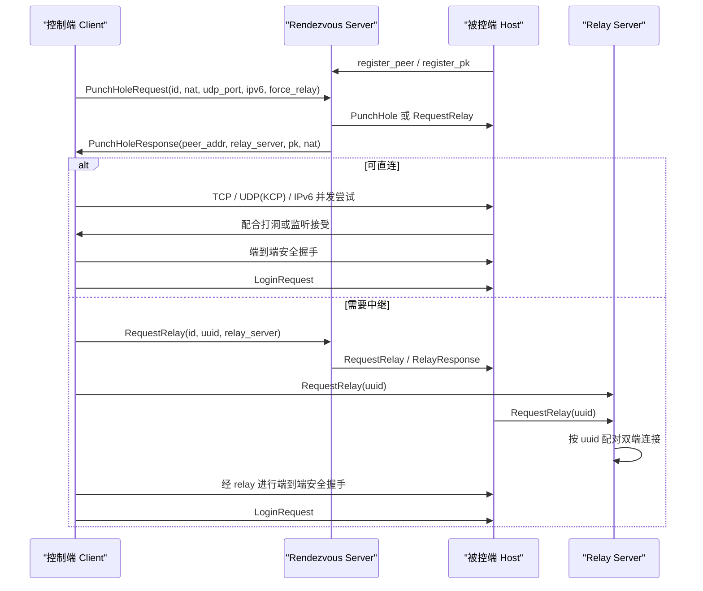

# 基于 Rendezvous + Relay 的远程连接方案设计

本文整理了当前 RustDesk 客户端仓库中可见的远程连接实现方式，重点说明：

- 如何通过 `rendezvous server` 完成设备发现与连接协调
- 如何优先尝试直连，再回退到 `relay server`
- 如何在中继场景下仍保持端到端安全握手
- 如果其他项目要沿用这一方案，应该保留哪些关键设计

说明：本仓库主要包含客户端与被控端逻辑；真正的 `hbbs/hbbr` 服务端实现位于独立的 `rustdesk-server` 项目中。因此本文对服务端内部转发细节只做“基于协议与调用方式可以确认”的说明，不臆测该仓库外的实现细节。

---

## 1. 设计目标

这个方案解决的是典型远程连接系统里的四个核心问题：

1. 设备如何被找到：用户只有一个设备 ID，不知道对方当前 IP
2. 双方如何穿透 NAT：尽量走 P2P，降低延迟和中继成本
3. 打不通时如何兜底：自动切到 relay，保证可用性
4. 中继下如何保证安全：relay 只转发，不持有最终业务明文

因此，整体设计不是“总是走中继”，而是：

`注册在线 -> 交换地址与能力 -> 并发尝试直连 -> 必要时请求中继 -> 完成端到端握手 -> 进入业务会话`

---

## 2. 角色划分

### 2.1 控制端（主动发起连接）

控制端主要负责：

- 选择 rendezvous server
- 检测 NAT / IPv6 / UDP 可用性
- 发起打洞请求
- 并发尝试 TCP / UDP / IPv6 直连
- 直连失败时请求 relay
- 连接建立后发送登录与业务消息

对应代码主要在：

- `src/client.rs`
- `src/common.rs`

### 2.2 被控端（等待被连接）

被控端主要负责：

- 向 rendezvous server 注册“我在线”
- 上传本机身份相关公钥
- 接收服务器下发的 `PunchHole` / `RequestRelay` / `FetchLocalAddr`
- 配合打洞、接受连接或接入 relay

对应代码主要在：

- `src/rendezvous_mediator.rs`
- `src/server.rs`

### 2.3 Rendezvous Server

它的职责是“信令协调”，不是最终业务传输通道。典型职责：

- 保存 `设备 ID -> 当前在线地址/状态`
- 帮双方交换外网地址、NAT 信息、公钥信息
- 选择或下发 relay server
- 推送 `PunchHole`、`RelayResponse`、`RequestRelay`

### 2.4 Relay Server

它的职责是“把两条连接桥起来并转发字节流”。

在当前客户端仓库可确认的语义是：

- 双方都主动连接 relay server
- 双方带上同一个 `uuid`
- relay server 按 `uuid` 进行配对
- 配对后转发字节流

relay server 不负责解释桌面协议本身，也不参与最终端到端会话密钥的生成。

---

## 3. 一张图看整体流程



---

## 4. RustDesk 当前实现中的关键步骤

## 4.1 选择 rendezvous server

控制端先获取 rendezvous server：

- `src/client.rs`
- `src/common.rs`

关键逻辑：

- 读取配置中的 server 列表
- 选择首选 server
- 若连接失败，尝试其他 server
- 后台刷新各 server 延迟，动态优化优先级

这一层的目标只有一个：让双方都能通过同一个协调入口完成信令交换。

---

## 4.2 探测 NAT / UDP / IPv6 能力

RustDesk 在连接前会尽量探测三类信息：

- NAT 类型
- UDP 是否可用于打洞
- IPv6 是否可用

相关位置：

- NAT 类型：`src/common.rs`
- UDP NAT 测试：`src/client.rs`
- IPv6 检测：`src/common.rs`

这里的设计思想非常值得复用：

1. 不要只依赖一种直连方式
2. 在请求阶段就把“本端能力”告诉 rendezvous server
3. 后续实际连接时并发尝试多个候选通路

---

## 4.3 发起打洞请求

控制端会向 rendezvous server 发送 `PunchHoleRequest`，里面包含：

- 目标设备 ID
- token
- NAT 类型
- 当前连接类型
- 版本号
- UDP 外部端口
- 是否强制 relay
- IPv6 地址信息

这个请求的意义是：

> “请帮我找到目标设备，并告诉双方应该优先如何互连。”

如果其他项目复用这套方案，建议将“能力信息”一并放在打洞请求里，而不是后续再补发。这样 rendezvous server 能一次性给出更准确的连接建议。

---

## 4.4 被控端常驻注册

被控端通过 `rendezvous_mediator` 持续与 rendezvous server 保持联系：

- 注册设备 ID：`register_peer`
- 上传公钥：`register_pk`

这一步决定了：

- 控制端输入一个设备 ID 后，服务端是否知道目标当前是否在线
- 之后的安全握手是否能拿到受信任的身份材料

对其他项目而言，这里有两个要点：

1. 在线注册必须是轻量、可心跳续约的
2. 身份公钥注册要与在线状态分离，避免每次连接都全量更新

---

## 5. 直连策略

## 5.1 优先直连，而不是直接中继

RustDesk 的实现不是串行地“先试 TCP，再试 UDP，再试 relay”，而是：

- 根据 NAT 和本地能力先决定可尝试的候选
- 实际建立连接时并发竞速
- 谁先成功就用谁

这在 `src/client.rs` 里能看到典型的 `select_ok` 模式：

- TCP 直连
- UDP 打洞后跑 KCP
- IPv6 连接

这类并发竞速有两个好处：

1. 降低平均连接建立时间
2. 避免某一条路径卡住拖慢整体体验

---

## 5.2 被控端如何配合打洞

被控端收到 `PunchHole` 后，会判断是否适合直连：

- 对称 NAT
- 开启代理 / WebSocket
- 强制 relay
- 禁止 TCP 监听且 UDP 又不可用

如果满足这些条件，就直接放弃直连，进入 relay 分支。

否则：

- 有 UDP 端口则走 UDP 打洞
- 否则走 TCP 打洞

这个策略很适合作为可复用模板：

### 建议的连接决策顺序

1. 若用户显式强制 relay，直接 relay
2. 若任一端是明显不利于 P2P 的网络环境，优先 relay
3. 若 IPv6 可用，可作为低成本高成功率候选
4. 若 UDP 可用，尝试 UDP 打洞
5. 若 TCP 可用，尝试 TCP 打洞
6. 全部失败则回退 relay

---

## 6. Relay 的详细使用方式

这部分是最适合被其他项目复用的核心。

## 6.1 Relay 不是默认入口，而是回退通道

RustDesk 里，走 relay 的触发条件主要包括：

- 用户强制 relay
- 对称 NAT 等明显不利于打洞的环境
- 代理 / WebSocket 环境
- 直连竞争失败

也就是说，relay 是“保证连得上”的兜底，而不是主路径。

---

## 6.2 控制端先向 rendezvous server 请求协调 relay

控制端不会一开始直接连 relay server，而是先向 rendezvous server 发 `RequestRelay`。

这个请求里最关键的字段有：

- `id`
- `token`
- `uuid`
- `relay_server`
- `secure`

其中 `uuid` 是这次 relay 会话的唯一配对标识。

这一步的作用是：

1. 通知 rendezvous server：我要中继
2. 让服务端把这件事通知给对端
3. 让双方拿到一致的 relay server 和 `uuid`

---

## 6.3 控制端再去连接真正的 relay server

拿到 `RelayResponse` 后，控制端才会连接 relay server 的 `RELAY_PORT`，然后再次发送 `RequestRelay`。

注意这里是第二次 `RequestRelay`，但语义已经不同：

- 发给 rendezvous server 的 `RequestRelay`：用于“协调”
- 发给 relay server 的 `RequestRelay`：用于“接入中继转发通道”

这是一个很好的分层设计。对复用者来说，建议保留这种两阶段做法，原因是：

1. 协调层与数据转发层职责清晰
2. relay server 可以尽量保持简单，只做配对与转发
3. rendezvous 层可以灵活加入权限、审计、策略、流量调度

---

## 6.4 被控端收到 relay 请求后也主动连接 relay server

被控端并不是被动等待 relay server 来拉自己，而是：

1. 收到 rendezvous server 下发的 `RequestRelay` / `RelayResponse`
2. 本地生成或使用相同的 `uuid`
3. 主动连接 relay server
4. 发送 `RequestRelay(uuid)`

因此，relay 的建立模型是：

> 双方都主动出站连接同一个 relay server，再由 relay server 按 `uuid` 配对。

这个模型比“relay server 反向拨入被控端”更适合 NAT/防火墙环境，因为双方通常都允许发起出站 TCP 连接。

---

## 6.5 为什么要用 `uuid` 配对

`uuid` 在 relay 设计里非常关键，它的作用相当于一次会话级别的临时票据：

- 不直接暴露业务会话内部状态
- 避免只靠设备 ID 配对造成歧义
- 支持同一设备同时存在多个待建立连接
- 让 relay server 的内部状态管理非常简单

如果其他项目沿用这套方案，建议：

- 每次 relay 会话使用新的随机 `uuid`
- `uuid` 只在短时间窗口内有效
- rendezvous server 和 relay server 都只把它当作“临时配对键”

---

## 6.6 Relay Server 的最小职责模型

从客户端协议使用方式来看，relay server 最小只需要实现下面这组能力：

1. 接收两侧的 TCP 连接
2. 读取第一条握手消息中的 `uuid`
3. 将相同 `uuid` 的两条连接配对
4. 配对成功后双向转发字节流
5. 超时清理未配对连接

因此，一个最小 relay server 可以抽象成：

```text
pending[uuid] = first_conn
if second_conn(uuid) arrives:
    pair(first_conn, second_conn)
    start_bidirectional_copy()
```

要做成生产可用，则还应补上：

- 超时回收
- 连接数限制
- 每 IP / 每账号限速
- 审计日志
- 可观测性指标

---

## 7. 安全模型

## 7.1 Client <-> Rendezvous 的链路保护

RustDesk 在与 rendezvous server 通信时，会通过 `secure_tcp()` 做一层安全握手。

其目标主要是保护：

- token
- 请求参数
- 中继协商过程

也就是说，协调信令本身不是裸奔的。

---

## 7.2 真正业务流量还有端到端握手

即使走 relay，控制端与被控端之间仍然会做端到端安全握手：

- 被控端先发 `SignedId`
- 控制端验证签名
- 控制端回 `PublicKey`
- 双方导出对称密钥
- 后续业务流量使用该密钥加密

这意味着 relay server 虽然能转发业务流量，但不应持有最终会话密钥。

对其他项目来说，这是最重要的复用原则之一：

> “relay 可见连接，不应可见最终业务明文。”

---

## 8. 登录与业务层如何叠在连接之上

无论最终底层路径是：

- 直连 TCP
- UDP + KCP
- IPv6
- relay

连接建立后，客户端都会进入统一的上层协议流程：

1. 发 `LoginRequest`
2. 服务端做授权与权限检查
3. 建立 `PeerInfo`
4. 开始传输：
   - 视频
   - 音频
   - 输入事件
   - 剪贴板
   - 文件传输
   - 终端
   - 端口转发

这说明这套设计的一个重要优点是：

> “传输层与业务层解耦。”

如果其他项目沿用它，应该让上层协议完全不知道底层是否经过 relay，只感知自己拿到的是一个可靠的双向字节流。

---

## 9. 适合其他项目直接复用的架构原则

## 9.1 三层拆分

建议把系统拆成三层：

### 第一层：发现与协调层

职责：

- 设备注册
- 在线发现
- NAT / 地址交换
- relay 协调

### 第二层：传输建立层

职责：

- TCP / UDP / IPv6 / relay 建连
- 连接超时与重试
- 直连与中继决策

### 第三层：会话协议层

职责：

- 登录
- 授权
- 业务消息
- 音视频 / 文件 / 终端等上层功能

这样做的好处是：

- 后续替换 relay 实现时不会影响业务协议
- 后续替换业务协议时不会影响打洞逻辑
- 便于分别扩容与调试

---

## 9.2 一定要保留“直连优先 + relay 兜底”

如果目标是做远程桌面、实时控制、远程游戏、音视频协同等场景，这个策略几乎是最实用的：

- 直连优先：降低延迟和带宽成本
- relay 兜底：保证成功率

不要反过来做成“默认中继，偶尔尝试直连”，否则：

- 服务器成本更高
- 延迟更高
- 规模上去后很难扛

---

## 9.3 Relay 不要承担业务协议语义

relay 最好只做四件事：

- 鉴别会话键
- 配对连接
- 转发字节
- 超时清理

不要把：

- 登录鉴权
- 权限判断
- 桌面协议解析
- 音视频重封装

都塞进 relay。否则 relay 会变得越来越重，难扩展、难定位问题。

---

## 9.4 让两端都主动出站连接 relay

这套方式非常适合复杂网络环境，因为它天然规避了大多数“反向连不进来”的问题。

建议其他项目也沿用：

- rendezvous 协调会话
- 双端主动出站连接 relay
- relay 以会话 `uuid` 配对

这是一个兼顾实现复杂度与成功率的折中点。

---

## 9.5 中继之后仍做端到端密钥协商

这是整套方案最不能丢的一点：

- relay 是“网络通道 fallback”
- 不是“安全模型 fallback”

也就是说，路径变了，安全边界不应该跟着退化。

---

## 10. 适合复用的最小协议草案

如果要在别的项目里复用这套方案，建议至少定义下面这些消息：

### Rendezvous 层消息

- `RegisterPeer { id, serial }`
- `RegisterPk { id, uuid, pk }`
- `PunchHoleRequest { id, token, nat_type, udp_port, ipv6, force_relay, conn_type }`
- `PunchHoleResponse { socket_addr, socket_addr_v6, nat_type, relay_server, pk, is_local }`
- `PunchHole { socket_addr, udp_port, nat_type, relay_server, force_relay }`
- `RequestRelay { id, uuid, relay_server, secure }`
- `RelayResponse { uuid, relay_server, socket_addr, socket_addr_v6, pk }`
- `FetchLocalAddr { ... }`

### Relay 层消息

- `RequestRelay { uuid, conn_type, auth_data? }`

### 业务层消息

- `LoginRequest`
- `LoginResponse`
- `PeerInfo`
- `VideoFrame` / `AudioFrame`
- `InputEvent`
- `Clipboard`
- `FileTransfer`

业务层消息不应该关心自己底层跑在：

- 直连 TCP
- UDP/KCP
- IPv6
- relay

---

## 11. 工程落地建议

如果要把这套方案真正复用到另一个项目，建议按下面的顺序落地。

## 阶段一：先做最小可用版

1. 设备注册与在线状态维护
2. `PunchHoleRequest / Response`
3. 强制 relay 的成功链路
4. relay 按 `uuid` 配对转发
5. 中继上的端到端安全握手

先把“必连得上”做出来。

## 阶段二：再做性能优化

1. TCP 打洞
2. UDP 打洞
3. KCP 或 QUIC 类可靠层
4. IPv6 直连
5. 并发竞速建连

再把“尽量连得快、延迟低”做出来。

## 阶段三：最后补全生产能力

1. 限流和配额
2. 日志和指标
3. 失败重试策略
4. 多机房 relay 调度
5. rendezvous / relay 高可用

---

## 12. 对应 RustDesk 代码的映射

为了方便二次实现，下面给出当前仓库的模块映射：

- 连接入口与直连/relay 决策：`src/client.rs`
- rendezvous 常驻通信：`src/rendezvous_mediator.rs`
- relay 接入后的 host 侧连接创建：`src/server.rs`
- 上层登录与业务会话：`src/server/connection.rs`
- NAT、server 选择、加密辅助：`src/common.rs`

如果是给新项目做参考，建议至少沿用这样的模块边界，而不是把它们都写进一个“大连接管理器”里。

---

## 13. 最后的架构总结

这套方案的核心思想可以概括为三句话：

1. `rendezvous` 负责找到人，并协调双方怎么连
2. `relay` 负责在打不通时帮双方桥接传输通道
3. 即使走 relay，最终会话也应保持端到端安全握手

如果其他项目要复用，最值得保留的是下面这几个设计点：

- 直连优先，relay 兜底
- 双端都主动出站连接 relay
- relay 按短期 `uuid` 配对
- 业务协议与传输路径解耦
- 中继之后仍做端到端密钥协商

这套设计兼顾了：

- 成功率
- 延迟
- 可扩展性
- 服务端成本
- 安全边界

对于远程桌面、远程运维、远程终端、设备协同、实时控制等场景，都是一套非常实用的基础方案。
